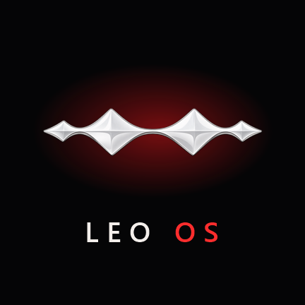
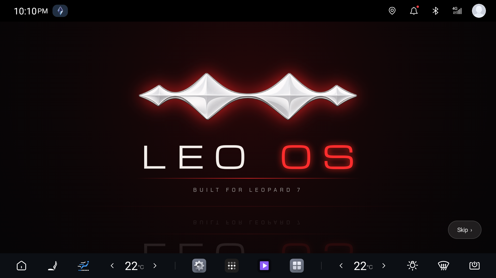
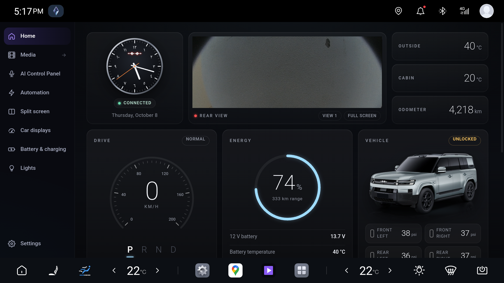
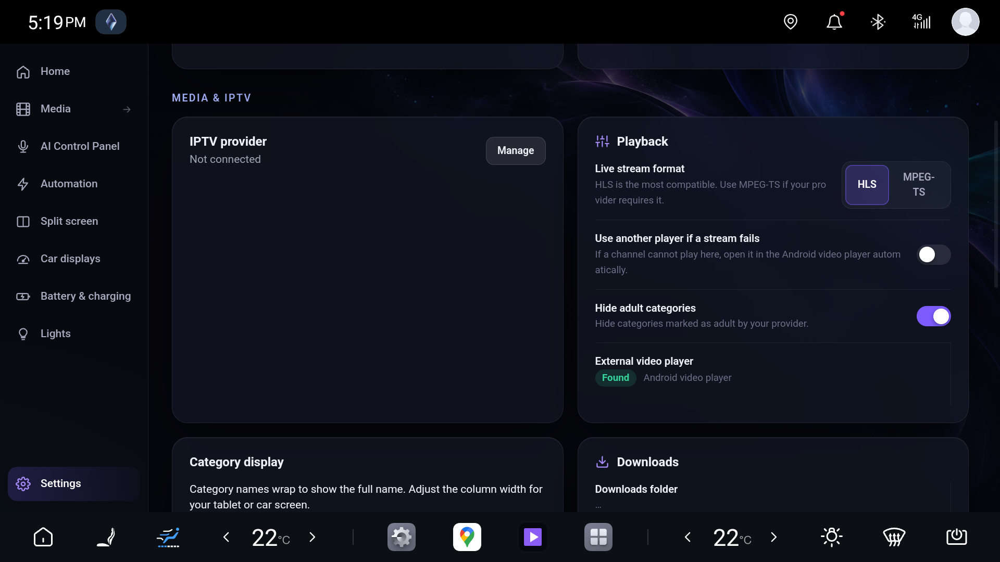

<h1 align="center">LEO OS</h1>

<b>A smarter screen for the BYD Leopard 7: dashboard, cluster maps, HUD, voice control in Arabic and English, charging limits, lights and media, in one app.</b>

<b>English</b> · <a href="README.ar.md">العربية</a>

  <a href="https://github.com/luaynedalawad-design/LEO-OS/releases/latest"><b>⬇ Download the latest version</b></a> ·
  Free · Unofficial · Made for the Leopard 7 (DiLink 5.1, Android 13)

---

 

## What is LEO OS?

LEO OS is an app for the car's centre screen. It brings together the things the car's own system hides
or doesn't do: a live dashboard, Google Maps on the instrument cluster, real turn arrows on the head-up
display, a voice assistant that understands any Arabic dialect, a charging limit that works even when the
car is off, interior light effects, split screen, and your own media.

It was built and tested by **Luay Awad** on his own Leopard 7, for personal use, and is shared **free of
charge** for anyone who finds it useful.

## Features

| | |
|---|---|
| **Dashboard (Home)** | Analog clock with Arabic numerals and the Leopard emblem, live rear camera, outside and cabin temperature, odometer, speed and gear, battery % and range, 12 V battery, doors, windows, trunk and roof, tyre pressures in PSI, seat belts, climate and quick controls, and trip statistics. |
| **Maps on the cluster** | Shows Google Maps full-screen on the instrument cluster, and puts it back by itself when the car wakes up. |
| **Head-up display (HUD)** | Turn arrows and a live distance countdown from Google Maps on the windshield HUD, synced with the car's speed. |
| **Voice assistant** | Arabic in any dialect, or English, in your own words: «سكّرلي الشباك», «شغّل المكيف على ٢٢», "close the roof and the windows". It asks you when something is unclear and runs several commands at once. It works from any screen with the steering-wheel mic button. |
| **Battery & charging** | Pick how full the battery charges (for example 90%). LEO OS saves the stop time in the car's own charging scheduler, so it stops at your limit even when the car is off. |
| **Lights** | Interior ambient colours and brightness, and light effects for when you're parked. |
| **Automation** | Simple rules: when something happens in the car, do something automatically. |
| **Split screen** | Two apps side by side on the centre screen. |
| **Car displays** | Cluster and HUD settings and blind-spot camera options. |
| **Media** | Your own IPTV subscription (live TV, movies, series), downloads, and an online series catalogue. |
| **AI Control Panel** | Every supported car control in one place, plus the voice settings. |

## Requirements

- **BYD Leopard 7** (方程豹 豹 7 / 钛 7) with DiLink 5.1 (Android 13). It has only been tested on this car.
- **Local ADB (USB/wireless debugging) enabled on the car.** LEO OS uses it to control car features, the
  same way BYDMate does. If you have never enabled it, follow the steps in the
  [BYDMate guide](https://github.com/AndyShaman/BYDMate). When the car asks **"Allow USB debugging?"**,
  tick **Always allow** and press **Allow**.
- Internet for the first start (to download the offline voice models) and for online voice.

## Installation

1. On the car's browser, open this page and download **`LEO-OS-<version>.apk`** from
   [Releases](https://github.com/luaynedalawad-design/LEO-OS/releases/latest). Or copy it to a USB stick.
2. Open the file and allow **Install unknown apps** if you're asked, then press **Install**.
3. Open **LEO OS** and read the licence. Press **I agree** to continue.
4. Allow the **microphone** and **notifications** when you're asked.
5. In **Car displays**, allow **notification access** (for the HUD arrows).
6. In the **AI Control Panel**, turn on **Mic button access** if you want the steering-wheel mic to open
   the voice assistant on any screen.

The two offline voice models download by themselves in the background the first time (about 700 MB in
total, one time only). A notification shows the progress, and updates keep them.

## Setup

### Fast voice (free Groq key, recommended)
Voice is about 10 times faster with Groq: about 0.5 s instead of 4–10 s.
1. On your phone, open **[console.groq.com/keys](https://console.groq.com/keys)** and sign in with Google.
2. Press **Create API Key**, name it `LEO`, and copy the key (it starts with `gsk_`).
3. Send it to yourself on WhatsApp or Telegram, open it on the car and copy it.
4. In LEO OS, open **AI Control Panel → Turn on fast online voice**, paste the key and press **Save**.

It's free and doesn't need a card. Without a key the voice still works offline, only slower.

### Claude key (optional)
Everyday car commands run on the car itself. A Claude key is only used for questions and requests LEO
doesn't recognise. Create it at [console.anthropic.com](https://console.anthropic.com) → API Keys (paid
per use), then add it in **AI Control Panel → Add Claude key**.

### IPTV (optional)
**Use your own IPTV subscription.** LEO OS doesn't include any channels or accounts. Go to **Settings →
Media & IPTV → IPTV provider → Manage**, enter the server URL, username and password from your provider,
and press **Save & connect**.

### Charging limit
Open **Battery & charging**, choose a limit (80%, 90% or your own), and turn on **Stop charging at my limit**.

## Settings, from A to Z

- **Car & voice:** voice and vehicle control (opens the AI Control Panel) and the steering-wheel buttons.
- **Media & IPTV:** your IPTV provider, playback (stream format, fallback player, hide adult categories),
  category display, downloads and library refresh.
- **LEO OS:** the startup intro, app updates (it checks this page for new versions) and About.
- **AI Control Panel:** mic button, best-accuracy voice model, fast online voice (Groq), Claude key, type
  a command, and all car controls grouped by type.

## Privacy

- **Your data never leaves your car.** IPTV logins, API keys and settings are stored only on your car,
  encrypted, and are never part of the app or this page.
- Voice: with a Groq key, your voice clip goes to Groq to be turned into text. Without a key, everything
  stays on the car. Questions sent to Claude go to Anthropic only if you add a Claude key.

## Acknowledgements

LEO OS would not exist without the open-source community. **Special thanks to the BYDMate team
([AndyShaman/BYDMate](https://github.com/AndyShaman/BYDMate))**: their research into the Leopard's vehicle
protocol and command catalogue helped us a lot. Parts derived from BYDMate are used under the PolyForm
Noncommercial License 1.0.0 (Required Notice: Copyright AndyShaman), which is why LEO OS is free and
noncommercial.

Thanks also to [whisper.cpp](https://github.com/ggml-org/whisper.cpp) and OpenAI Whisper (offline speech),
AndroidX / Media3 (ExoPlayer), hls.js and mpegts.js, and the Michroma and Chakra Petch fonts. See
[THIRD-PARTY-NOTICES.txt](THIRD-PARTY-NOTICES.txt).

## Licence and disclaimer

**© 2026 Luay Awad. All rights reserved.** LEO OS is free to download and use for personal,
noncommercial use, and you may share the unmodified app. Copying, decompiling, modifying, re-signing or
selling it, or using it to build a similar product, is not permitted. See [LICENSE.txt](LICENSE.txt).

> **Disclaimer:** LEO OS is an independent, unofficial project. It is not made, approved or supported by
> BYD, and it was tested only on the author's own car. It is provided **"as is", without any warranty**,
> and **you use it entirely at your own risk**. The author is not responsible for any damage to your
> vehicle or its warranty, injury, accident, fine, data loss, or costs (including API or data charges), or
> for the content you access with your own subscriptions. Never let the app distract you while driving.
> By installing LEO OS you accept the full [licence](LICENSE.txt).

BYD, Leopard and their logos are trademarks of BYD Company Limited, used only to identify the vehicle.
